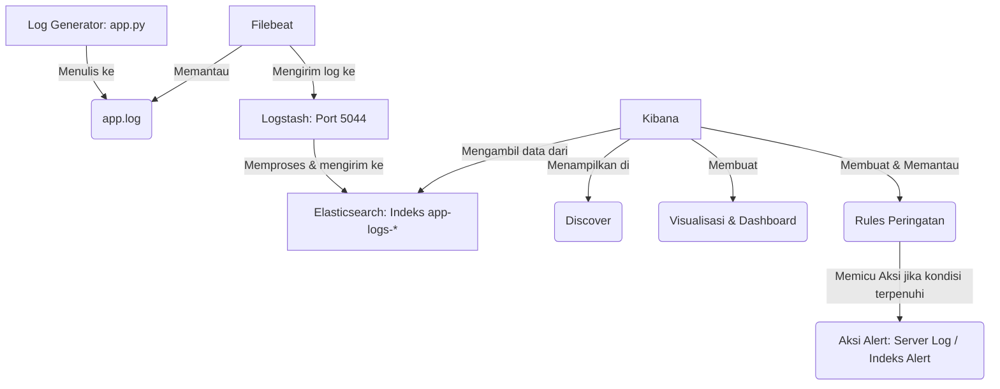

# Hands-on: Monitoring Log ERROR dengan ELK Stack di WSL Ubuntu

## Pendahuluan

Selamat datang di tutorial hands-on ELK Stack! Dalam tutorial ini, kita akan mempelajari cara menggunakan Elasticsearch, Logstash, dan Kibana (ELK) untuk memonitor log aplikasi secara real-time. Fokus utama kita adalah mendeteksi dan memberi peringatan (alert) ketika terjadi lonjakan jumlah pesan ERROR dalam periode waktu tertentu.

**Skenario:**
Kita akan mensimulasikan sebuah aplikasi sederhana yang menghasilkan log. Kemudian, kita akan mengkonfigurasi ELK Stack untuk:
1. Mengumpulkan log dari aplikasi menggunakan Filebeat.
2. Memproses dan memperkaya log menggunakan Logstash.
3. Menyimpan dan mengindeks log menggunakan Elasticsearch.
4. Memvisualisasikan log dan membuat sistem peringatan di Kibana yang akan aktif jika terdapat 1000 pesan ERROR atau lebih dalam rentang waktu 1 menit.

## Alur Kerja Tutorial (Flowchart)

Berikut adalah gambaran umum alur kerja data dan komponen dalam tutorial ini:

1.  **Penghasil Log (Log Generation)**:
    *   Skrip Python (`log-generator/app.py`) menghasilkan log aplikasi.
    *   Log ditulis ke file `log-generator/app.log`.
    *   Skrip `generate_errors.sh` atau `generate_random_logs.sh` dapat digunakan untuk menghasilkan log dalam jumlah banyak atau secara acak.

2.  **Pengumpulan Log (Log Collection) - Filebeat**:
    *   Filebeat (`filebeat-config/custom-filebeat.yml`) dikonfigurasi untuk memantau (`tail`) file `app.log`.
    *   Setiap baris log baru yang ditambahkan ke `app.log` akan diambil oleh Filebeat.
    *   Filebeat mengirimkan log yang dikumpulkan ke Logstash (biasanya ke port 5044).

3.  **Pemrosesan Log (Log Processing) - Logstash**:
    *   Logstash (`logstash-config/02-app-logs.conf`) menerima log dari Filebeat melalui input `beats`.
    *   Logstash mem-parsing setiap log menggunakan filter `grok` untuk mengekstrak field terstruktur (misalnya, `timestamp`, `log_level`, `message`).
    *   Logstash kemudian mengirimkan log yang telah diproses dan terstruktur ke Elasticsearch.

4.  **Penyimpanan & Pengindeksan Log (Log Storage & Indexing) - Elasticsearch**:
    *   Elasticsearch menerima data log terstruktur dari Logstash.
    *   Elasticsearch menyimpan log ini sebagai dokumen JSON.
    *   Log diindeks (dalam contoh ini, ke dalam indeks dengan pola `app-logs-*`) agar dapat dicari dan dianalisis dengan cepat.

5.  **Visualisasi, Analisis, & Peringatan (Visualization, Analysis & Alerting) - Kibana**:
    *   Kibana terhubung ke Elasticsearch untuk mengambil dan menampilkan data.
    *   **Index Pattern**: Anda membuat index pattern (`app-logs-*`) di Kibana agar Kibana tahu field mana saja yang tersedia untuk analisis.
    *   **Discover**: Anda dapat melihat log mentah yang masuk melalui menu Discover di Kibana.
    *   **Visualizations & Dashboards**: Anda dapat membuat visualisasi (misalnya, grafik tren error, jumlah total error) dan menggabungkannya dalam dashboard untuk pemantauan.
    *   **Alerting**: Anda mengkonfigurasi rule peringatan di Kibana untuk memantau data di Elasticsearch (misalnya, lonjakan jumlah log dengan `log_level: "ERROR"`). Jika kondisi rule terpenuhi, Kibana akan memicu aksi yang telah ditentukan (misalnya, mencatat alert ke log server Kibana atau membuat dokumen alert di indeks lain).



## Prasyarat

Sebelum memulai, pastikan Anda memiliki:
1.  **ELK Stack (Elasticsearch, Logstash, Kibana) versi 7.17.x** terinstal dan berjalan dengan baik di WSL Ubuntu. Anda dapat mengikuti skrip `../install-elk-stack.sh` jika belum terinstal. Pastikan semua layanan (elasticsearch, logstash, kibana) sudah berjalan.
    ```bash
    sudo systemctl status elasticsearch
    sudo systemctl status logstash
    sudo systemctl status kibana
    ```
2.  **Filebeat versi 7.17.x** terinstal dan berjalan. Skrip instalasi utama (`../install-elk-stack.sh`) seharusnya sudah mencakup ini.
    ```bash
    sudo systemctl status filebeat
    ```
3.  **WSL Ubuntu** dengan **Python 3** terinstal (digunakan oleh skrip penghasil log).
    ```bash
    python3 --version
    sudo apt install python3-pip # Jika belum ada pip
    ```
4.  **curl** dan **jq** (opsional, untuk mempermudah inspeksi JSON dari curl).
    ```bash
    sudo apt install curl jq
    ```
5.  Pemahaman dasar tentang perintah Linux dan terminal.

## Langkah-langkah Implementasi

### Langkah 1: Persiapan Direktori dan Skrip Penghasil Log

Pertama, kita akan membuat skrip Python sederhana yang akan menghasilkan log ke sebuah file. Log ini akan mencakup pesan INFO dan ERROR.

1.  **Buat Struktur Direktori**:
    Jika belum ada, direktori `hands-on-elk-monitoring`, `log-generator`, `filebeat-config`, dan `logstash-config` akan dibuat. Kita akan menyimpan file log aplikasi di `hands-on-elk-monitoring/log-generator/app.log`.

2.  **Buat Skrip Python Penghasil Log (`log-generator/app.py`)**:
    Skrip ini akan menulis log ke `app.log` dengan format `[TIMESTAMP] LEVEL: Pesan`.

3.  **Buat Skrip untuk Memicu Error (`log-generator/generate_errors.sh`)**:
    Skrip ini akan menjalankan `app.py` untuk menghasilkan sejumlah besar pesan ERROR dalam waktu singkat.

### Langkah 2: Konfigurasi Filebeat untuk Mengumpulkan Log Aplikasi

Filebeat akan bertugas memantau file `app.log` dan mengirim setiap baris log baru ke Logstash.

1.  **Buat File Konfigurasi Filebeat (`filebeat-config/custom-filebeat.yml`)**:
    Kita akan membuat konfigurasi khusus untuk Filebeat yang menargetkan log aplikasi kita.

2.  **Hentikan Layanan Filebeat Default (jika berjalan dengan konfigurasi lain)**:
    ```bash
    sudo systemctl stop filebeat
    ```

3.  **Jalankan Filebeat dengan Konfigurasi Baru**:
    Buka terminal baru khusus untuk Filebeat.
    ```bash
    cd /home/giangianna/elk-tutorial/hands-on-elk-monitoring

    sudo chown root:root /home/giangianna/elk-tutorial/hands-on-elk-monitoring/filebeat-config/custom-filebeat.yml
    
    sudo filebeat -e -c /home/giangianna/elk-tutorial/hands-on-elk-monitoring/filebeat-config/custom-filebeat.yml -d "publish"
    ```
    Perintah `-e` mencetak log ke stderr, `-c` menentukan file konfigurasi, dan `-d "publish"` memberikan output debug terkait pengiriman event. Biarkan terminal ini berjalan.

### Langkah 3: Konfigurasi Logstash untuk Memproses Log

Logstash akan menerima data dari Filebeat, mem-parsingnya untuk mengekstrak informasi penting (seperti level log), dan kemudian mengirimkannya ke Elasticsearch.

1.  **Buat File Konfigurasi Logstash (`logstash-config/02-app-logs.conf`)**:
    File ini akan mendefinisikan pipeline pemrosesan log aplikasi.

2.  **Pastikan Konfigurasi Logstash Utama Mengarah ke Direktori yang Benar**:
    Konfigurasi Logstash default (`/etc/logstash/pipelines.yml` atau pengaturan di `logstash.yml`) biasanya memuat semua file `.conf` dari `/etc/logstash/conf.d/`. Kita akan menempatkan file konfigurasi kita di sana atau menjalankan Logstash dengan menunjuk langsung ke file ini jika diperlukan (untuk kesederhanaan, kita akan mengasumsikan pemuatan dari `conf.d`).

    Salin konfigurasi baru ke direktori konfigurasi Logstash:
    ```bash
    sudo cp /home/giangianna/elk-tutorial/hands-on-elk-monitoring/logstash-config/02-app-logs.conf /etc/logstash/conf.d/
    ```

3.  **Uji Konfigurasi Logstash (Opsional tapi direkomendasikan)**:
    ```bash
    sudo -u logstash /usr/share/logstash/bin/logstash --config.test_and_exit -f /etc/logstash/conf.d/02-app-logs.conf
    ```
    Jika ada error, perbaiki sebelum melanjutkan. Anda mungkin melihat beberapa peringatan (WARNING) terkait `logstash.yml`, `log4j2.properties`, atau `ecs_compatibility`. Jika diakhiri dengan `Configuration OK`, maka konfigurasi valid.

4.  **Restart Layanan Logstash untuk Menerapkan Konfigurasi Baru**:
    ```bash
    sudo systemctl restart logstash
    sudo systemctl status logstash # Pastikan aktif dan tidak ada error
    # Untuk melihat log Logstash jika ada masalah:
    # sudo journalctl -u logstash -f
    ```
    > **Catatan Troubleshooting Logstash Gagal Restart:** Jika `sudo systemctl restart logstash` memakan waktu sangat lama, gagal, atau Logstash tidak berjalan dengan benar setelahnya (cek dengan `sudo systemctl status logstash` dan `sudo journalctl -u logstash -n 50 --no-pager`), mungkin ada proses Logstash lama yang tidak berhenti dengan benar.
    > Anda bisa mencoba langkah-langkah berikut:
    > 1.  Cari proses Logstash yang mungkin masih berjalan: `ps aux | grep logstash`
    > 2.  Jika ada proses Logstash yang berjalan (selain perintah `grep` itu sendiri), catat PID-nya.
    > 3.  Hentikan paksa proses tersebut: `sudo kill -9 <PID_PROSES_LOGSTASH>` (ganti `<PID_PROSES_LOGSTASH>` dengan PID yang Anda catat).
    > 4.  Coba jalankan Logstash lagi: `sudo systemctl start logstash`
    > 5.  Periksa statusnya: `sudo systemctl status logstash`
    > 6.  Periksa log terbaru: `sudo journalctl -u logstash -n 100 --no-pager`

### Langkah 4: Verifikasi Data di Elasticsearch & Kibana

Setelah Filebeat mengirim log ke Logstash, dan Logstash memprosesnya ke Elasticsearch, kita perlu memverifikasi bahwa data masuk dengan benar.

1.  **Hasilkan Beberapa Log dan Verifikasi Pengiriman oleh Filebeat**:
    *   Buka terminal baru, navigasi ke `/home/giangianna/elk-tutorial/hands-on-elk-monitoring/log-generator/` dan jalankan skrip Python beberapa kali untuk menghasilkan log:
        ```bash
        cd /home/giangianna/elk-tutorial/hands-on-elk-monitoring/log-generator/
        python3 app.py "Ini adalah pesan INFO pertama dari aplikasi."
        python3 app.py "Sebuah ERROR terjadi: Gagal memproses permintaan." error
        python3 app.py "Operasi berhasil diselesaikan."
        ```
    *   Periksa file `app.log` di direktori yang sama untuk memastikan log-log di atas telah tertulis.
        ```bash
        tail -n 5 /home/giangianna/elk-tutorial/hands-on-elk-monitoring/log-generator/app.log
        ```
    *   **PENTING: Periksa Terminal Filebeat**: Kembali ke terminal tempat Anda menjalankan Filebeat (dengan perintah `sudo filebeat -e -c ...`). Amati outputnya. Anda seharusnya melihat:
        *   Pesan yang mengindikasikan koneksi berhasil ke Logstash (biasanya di `localhost:5044`).
        *   Pesan `Event published.` atau sejenisnya untuk setiap log yang dikirim.
        *   Tidak ada pesan error berkelanjutan terkait koneksi atau pengiriman.
        Jika Anda tidak melihat aktivitas pengiriman atau ada error, ini adalah titik utama yang perlu di-debug sebelum melanjutkan. Pastikan Logstash berjalan dan Filebeat dapat menghubunginya.

2.  **Buat Index Pattern di Kibana**:
    *   Buka Kibana di browser Anda (biasanya `http://localhost:5601`).
    *   Navigasi ke **Stack Management > Kibana > Index Patterns**.
    *   Klik **Create index pattern**.
    *   Masukkan `app-logs-*` sebagai nama pattern. Klik **Next step**.
    *   Pilih `@timestamp` sebagai Primary time field. Klik **Create index pattern**.

3.  **Lihat Log di Kibana Discover**:
    *   Buka menu navigasi Kibana (ikon hamburger di kiri atas).
    *   Pilih **Discover**.
    *   Pilih index pattern `app-logs-*` yang baru saja Anda buat.
    *   Anda seharusnya melihat log yang dihasilkan oleh `app.py`. Periksa field seperti `log_level` dan `message`.

### Langkah 5: Membuat Alert di Kibana untuk Lonjakan ERROR

Sebelum dapat membuat rule, terutama jika Anda baru pertama kali mengakses fitur alerting di Kibana 7.17.x atau melihat pesan "Additional setup required", Anda mungkin perlu mengatur encryption key untuk saved objects.

**Penting: Pengaturan Encryption Key untuk Kibana Alerting (Jika Diperlukan)**

Jika Anda menemui pesan bahwa "Additional setup is required" atau fitur alerting tidak dapat digunakan karena encryption key belum diatur, ikuti langkah-langkah berikut:

1.  **Hasilkan Encryption Key**:
    Buka terminal dan jalankan perintah berikut untuk menghasilkan key acak:
    ```bash
    openssl rand -hex 32
    ```
    Salin key yang dihasilkan (contoh: `764167d212a8af2f9e9a32b10db8b6358f7225e740e8b897db9869dc9c28d87f`, **gunakan key yang Anda hasilkan sendiri**).

2.  **Tambahkan Key ke Konfigurasi Kibana**:
    Edit file `/etc/kibana/kibana.yml` dan tambahkan baris berikut di akhir file. Ganti `YOUR_GENERATED_KEY` dengan key yang Anda salin dari langkah sebelumnya.
    ```bash
    echo 'xpack.encryptedSavedObjects.encryptionKey: YOUR_GENERATED_KEY' | sudo tee -a /etc/kibana/kibana.yml
    ```
    Contoh dengan key di atas (INGAT: gunakan key Anda sendiri):
    ```bash
    echo 'xpack.encryptedSavedObjects.encryptionKey: 764167d212a8af2f9e9a32b10db8b6358f7225e740e8b897db9869dc9c28d87f' | sudo tee -a /etc/kibana/kibana.yml
    ```

3.  **Restart Layanan Kibana**:
    ```bash
    sudo systemctl restart kibana
    sudo systemctl status kibana # Pastikan aktif dan tidak ada error
    ```
    Setelah Kibana berhasil restart, Anda seharusnya dapat melanjutkan untuk membuat rule.

Sekarang kita akan membuat rule di Kibana yang akan memicu alert jika ada 1000 atau lebih log dengan level ERROR dalam 1 menit.

1.  **Navigasi ke Rules**:
    *   Di Kibana, buka menu navigasi.
    *   Pilih **Stack Management > Rules and Connectors**. (Nama menu mungkin sedikit berbeda tergantung versi minor Kibana 7.17.x, bisa juga di bawah "Alerts and Actions").

2.  **Buat Rule Baru**:
    *   Klik **Create rule**.
    *   **Rule type**: Pilih **Elasticsearch query**. *(Catatan: Ini diubah dari "Index threshold" untuk mengakomodasi filter KQL secara langsung dalam query jika opsi filter terpisah tidak ada di versi Anda).*
    *   **Name**: Beri nama rule, misalnya `Lonjakan Error Aplikasi`.
    *   **Tags** (opsional): Tambahkan tag seperti `aplikasi`, `error`.

3.  **Definisikan Kondisi (Define conditions)**:
    *   **Indices to query**: Masukkan `app-logs-*`.
    *   **Time field**: Biarkan `@timestamp`.
    *   **Query (KQL, Lucene, atau JSON)**: Masukkan query untuk memfilter log ERROR.
        *   **Opsi 1: KQL (lebih sederhana)**
            ```kql
            log_level: "ERROR"
            ```
        *   **Opsi 2: Elasticsearch Query DSL (JSON - jika KQL tidak bekerja atau preferensi lain)**
            ```json
            {
              "bool": {
                "must": [
                  {
                    "term": {
                      "log_level.keyword": "ERROR"
                    }
                  }
                ]
              }
            }
            ```
    *   **Condition** (atau "Trigger when", "Alert when" - label bisa bervariasi): Atur agar rule terpicu ketika jumlah dokumen yang cocok dengan query di atas memenuhi threshold.
        *   Pilih `count()`
        *   Set threshold: `IS ABOVE OR EQUAL TO 1000` (atau `matches IS GREATER THAN OR EQUAL TO 1000`)
    *   **Time window** (atau "For the last"): `1 minute`

    Ini berarti: "Ketika jumlah dokumen di `app-logs-*` yang cocok dengan query `log_level: "ERROR"` adalah 1000 atau lebih selama 1 menit terakhir."

4.  **Tambahkan Aksi (Add actions)**:
    *   Untuk kesederhanaan, kita akan menggunakan aksi "Server log" atau "Index".
    *   **Action type**: Pilih **Server log**. Ini akan mencatat alert di log Kibana. (Di Kibana, ini mungkin muncul sebagai pilihan konektor "Server log").
        *   **Level**: Pilih `error`. Jika `critical` tersedia, itu lebih baik. Jika tidak, `error` adalah pilihan yang baik. Pilih level tertinggi yang tersedia yang menandakan masalah serius. (Ini mungkin disebut "Severity" di beberapa dokumentasi, namun di UI biasanya "Level").
        *   **Message**: Anda bisa menggunakan variabel, contoh:
            `Terdeteksi {{state.thresholdResult.count}} pesan ERROR dalam 1 menit terakhir pada indeks {{context.index}}. Threshold: {{context.threshold}}.`
    *   Alternatif lain adalah **Index action**, yang akan menyimpan alert sebagai dokumen di Elasticsearch.
        *   **Penting**: Aksi "Index" ini tidak melakukan filter tambahan pada log aplikasi. Pemfilteran untuk `log_level: "ERROR"` sudah dilakukan pada tahap **Definisikan Kondisi** rule (Langkah 5, point 3). Aksi "Index" hanya mencatat informasi bahwa rule tersebut (yang sudah difilter untuk error) telah terpicu.
        *   **Index**: Beri nama indeks untuk alert, misal `app-alerts`.
        *   **Refresh**: `true`.
        *   **Document to index** contoh (Anda bisa menyesuaikan field ini sesuai kebutuhan):
            ```json
            {
                "@timestamp": "{{date}}",
                "rule_id": "{{rule.id}}",
                "rule_name": "{{rule.name}}",
                "alert_id": "{{alert.id}}",
                "context_message": "{{context.message}}",
                "alert_status": "{{alert.instance.status}}", 
                "message_from_rule": "{{context.message}}", 
                "trigger_summary": "Rule '{{rule.name}}' terpicu. Jumlah error: {{state.thresholdResult.count}}. Threshold: {{state.thresholdResult.threshold}}.",
                "trigger_count": "{{state.thresholdResult.count}}",
                "configured_threshold": "{{state.thresholdResult.threshold}}",
                "queried_indices": "{{context.conditions.indices}}", 
                "time_window": "{{context.conditions.timeWindow}}" 
            }
            ```
            *Catatan: Ketersediaan variabel seperti `{{alert.instance.status}}`, `{{context.message}}`, `{{context.conditions.indices}}`, dan `{{context.conditions.timeWindow}}` dapat bervariasi. Uji dengan variabel dasar terlebih dahulu jika ada masalah.*

5.  **Simpan Rule**:
    *   Atur **Notification frequency** sesuai kebutuhan (misalnya, "Notify when status changes" atau setiap interval tertentu jika kondisi masih terpenuhi). Untuk pengujian, "Notify when status changes" sudah cukup.
    *   Klik **Create rule**.

### Langkah 6: Uji Coba Alert

Saatnya menguji apakah alert kita berfungsi.

1.  **Hasilkan Lonjakan Log ERROR**:
    Buka terminal, navigasi ke `/home/giangianna/elk-tutorial/hands-on-elk-monitoring/log-generator/` dan jalankan skrip `generate_errors.sh`. Skrip ini akan memanggil `app.py` berulang kali untuk menghasilkan banyak pesan ERROR.
    ```bash
    cd /home/giangianna/elk-tutorial/hands-on-elk-monitoring/log-generator/
    bash generate_errors.sh
    ```
    Skrip ini mungkin membutuhkan waktu beberapa detik hingga satu menit untuk menghasilkan 1000+ error.

2.  **Pantau di Kibana**:
    *   **Discover**: Anda akan melihat lonjakan pesan ERROR di Discover untuk index `app-logs-*`.
    *   **Rules**: Kembali ke halaman **Stack Management > Rules and Connectors**. Anda akan melihat status rule berubah menjadi "Active" atau "Triggered" jika kondisi terpenuhi. Klik nama rule untuk detail lebih lanjut.
    *   **Log Kibana (jika menggunakan Server log action)**: Anda perlu memeriksa log server Kibana. Cara termudah adalah melalui `sudo journalctl -u kibana -f` di terminal WSL Anda.
    *   **Indeks Alert (jika menggunakan Index action)**: Jika Anda menggunakan Index action, Anda bisa membuat index pattern baru di Kibana untuk `app-alerts` (atau nama yang Anda pilih) dan melihat dokumen alert di Discover.

3.  **Verifikasi Alert**:
    Setelah beberapa saat (sesuai interval pengecekan rule), alert seharusnya terpicu. Anda akan melihat notifikasi sesuai dengan aksi yang Anda konfigurasikan.

### Langkah 7: Membuat Dashboard Deteksi Error di Kibana (Opsional)

Setelah data log masuk dan alert dikonfigurasi, membuat dashboard dapat membantu Anda memvisualisasikan tren error secara lebih komprehensif.

1.  **Tujuan Dashboard**:
    *   Menampilkan jumlah total error secara real-time atau dalam rentang waktu tertentu.
    *   Menunjukkan tren error dari waktu ke waktu (misalnya, per jam atau per hari).
    *   Menampilkan pesan error yang paling sering muncul (jika relevan).

2.  **Membuat Visualisasi Individual**:
    Anda perlu membuat beberapa visualisasi terlebih dahulu sebelum dapat menambahkannya ke dashboard.
    *   Navigasi ke **Kibana > Visualize Library** (atau "Visualize" di menu utama tergantung versi minor).
    *   Klik **Create visualization**.

    a.  **Visualisasi Metrik: Jumlah Total Error**
        *   **Tipe Visualisasi**: Pilih **Metric**.
        *   **Sumber Data/Index Pattern**: Pilih `app-logs-*`.
        *   **Metrics**:
            *   Aggregation: **Count**.
        *   **Filter**: Tambahkan filter KQL di atas panel visualisasi: `log_level: "ERROR"`
        *   **Simpan Visualisasi**: Beri nama, misalnya, "Total Pesan ERROR".

    b.  **Visualisasi Line Chart: Tren Error per Waktu**
        *   **Tipe Visualisasi**: Pilih **Line** (atau Area, Bar).
        *   **Sumber Data/Index Pattern**: Pilih `app-logs-*`.
        *   **Metrics (Y-axis)**:
            *   Aggregation: **Count**.
        *   **Buckets (X-axis)**:
            *   Aggregation: **Date Histogram**.
            *   Field: `@timestamp`.
            *   Interval: Pilih interval yang sesuai (misalnya, `Auto`, `Hourly`, `Daily`).
        *   **Filter**: Tambahkan filter KQL di atas panel visualisasi: `log_level: "ERROR"`
        *   **Simpan Visualisasi**: Beri nama, misalnya, "Tren ERROR per Waktu".

    c.  **(Opsional) Visualisasi Pie Chart: Pesan Error Teratas**
        *   Jika Anda ingin melihat distribusi pesan error yang paling umum.
        *   **Tipe Visualisasi**: Pilih **Pie**.
        *   **Sumber Data/Index Pattern**: Pilih `app-logs-*`.
        *   **Metrics (Slice size)**:
            *   Aggregation: **Count**.
        *   **Buckets (Split slices)**:
            *   Aggregation: **Terms**.
            *   Field: `message.keyword` (Pastikan field `message` memiliki sub-field `.keyword` untuk agregasi terms. Jika tidak, Anda mungkin perlu menyesuaikan mapping Elasticsearch atau menggunakan field lain).
            *   Order by: `Metric: Count`.
            *   Size: `5` atau `10` (untuk menampilkan 5 atau 10 pesan error teratas).
        *   **Filter**: Tambahkan filter KQL di atas panel visualisasi: `log_level: "ERROR"`
        *   **Simpan Visualisasi**: Beri nama, misalnya, "Pesan ERROR Teratas".

3.  **Membuat Dashboard Baru**:
    *   Navigasi ke **Kibana > Dashboard**.
    *   Klik **Create dashboard**.
    *   Klik **Add from library** (atau tombol serupa untuk menambahkan panel).
    *   Cari dan tambahkan visualisasi yang telah Anda buat ("Total Pesan ERROR", "Tren ERROR per Waktu", "Pesan ERROR Teratas").
    *   Susun dan ubah ukuran visualisasi di dashboard sesuai keinginan Anda.
    *   **Simpan Dashboard**: Klik **Save**, beri nama, misalnya, "Dashboard Monitoring Error Aplikasi".

4.  **Menggunakan Dashboard**:
    *   Anda dapat mengatur rentang waktu global di pojok kanan atas Kibana untuk melihat data pada periode yang berbeda.
    *   Dashboard akan secara otomatis diperbarui jika Anda mengatur refresh interval.
    *   Anda juga bisa menambahkan filter KQL langsung di bar pencarian dashboard untuk analisis lebih lanjut.

## Troubleshooting Umum

*   **Layanan ELK Tidak Berjalan**:
    Gunakan `sudo systemctl status <nama-layanan>` untuk memeriksa. Jika ada masalah, gunakan `sudo journalctl -u <nama-layanan> -f` untuk melihat log detail. Pastikan alokasi memori untuk Elasticsearch (`jvm.options`) cukup tetapi tidak melebihi kapasitas WSL Anda.
*   **Filebeat Tidak Mengirim Log**:
    Periksa output terminal Filebeat (jika dijalankan dengan `-e`). Pastikan path ke `app.log` di `custom-filebeat.yml` benar dan Filebeat memiliki izin untuk membacanya. Pastikan Logstash bisa dijangkau oleh Filebeat.
*   **Logstash Error Parsing atau Tidak Menerima Data**:
    Periksa log Logstash (`sudo journalctl -u logstash -f`). Pastikan konfigurasi input (beats) dan filter (grok) sudah benar. Pola grok harus sesuai dengan format log dari `app.py`.
*   **Kibana Tidak Menampilkan Data atau Alert Tidak Terpicu**:
    Pastikan index pattern di Kibana sudah benar. Verifikasi bahwa data memang masuk ke Elasticsearch (Anda bisa query Elasticsearch langsung via `curl` jika perlu). Untuk alert, pastikan kondisi, filter KQL, dan time window sudah tepat. Periksa log Kibana untuk error terkait eksekusi rule.

## Kesimpulan

Selamat! Anda telah berhasil mengkonfigurasi ELK Stack untuk memonitor log aplikasi dan membuat sistem peringatan untuk lonjakan pesan ERROR. Anda telah mempelajari:
- Cara Filebeat mengumpulkan log.
- Cara Logstash memproses dan mentransformasi log.
- Cara Elasticsearch menyimpan dan mengindeks log.
- Cara Kibana memvisualisasikan log dan membuat rule peringatan (alerting).
- (Opsional) Cara membuat dashboard sederhana di Kibana untuk memantau error.

Dari sini, Anda dapat mengeksplorasi lebih lanjut:
- Pola grok yang lebih kompleks.
- Visualisasi yang lebih canggih di Kibana (Dashboard).
- Aksi alert yang berbeda (misalnya, mengirim email, notifikasi Slack - ini memerlukan konfigurasi konektor tambahan).
- Menggunakan Elasticsearch Watcher (fitur berbayar) atau ElastAlert (open-source) untuk alerting yang lebih advanced jika versi gratis Kibana alerting kurang memadai untuk kebutuhan produksi.

Semoga tutorial ini bermanfaat!
